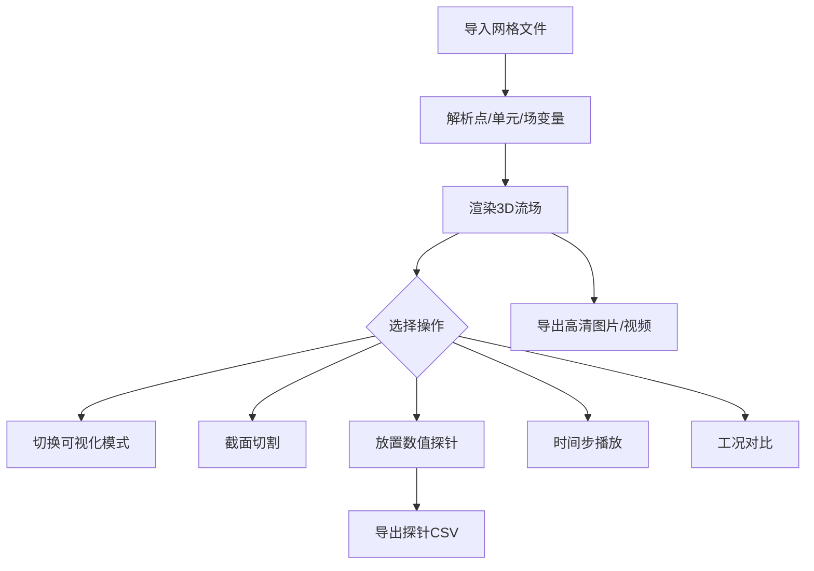

## 1. 产品概述

本工具是一个面向 CFD（计算流体动力学）工程师与科研人员的浏览器端三维流场可视化平台。用户导入 CFD 求解器输出的网格数据文件后，平台解析并渲染三维流场，支持流线图、速度矢量图、压力云图等多种可视化模式切换，并提供截面切割、时间步播放、数值探针、工况对比与高清导出等能力，解决"轻量化、即时、可交互"查看 CFD 结果的需求。

- 目标用户：CFD 工程师、流体力学研究者、航空航天 / 汽车 / 能源领域仿真工程师
- 核心价值：无需重型桌面软件（ParaView / Tecplot），在浏览器中即可完成流场可视化、量取、对比与汇报素材导出

## 2. 核心功能

### 2.1 用户角色
| 角色 | 使用方式 | 核心权限 |
|------|---------------------|------------------|
| 分析工程师 | 直接打开网页，导入数据 | 全部可视化、探针、对比、导出功能 |

### 2.2 功能模块
1. **工作台主视图**：数据导入、可视化模式切换、3D 视口、视图控制、截面工具
2. **时间序列面板**：时间步时间轴、播放控制、逐帧浏览
3. **数值探针面板**：探针放置、时序数据图表、CSV 导出
4. **工况对比视图**：多结果并排、同步相机、差异高亮

### 2.3 页面详情
| 页面名称 | 模块名称 | 功能描述 |
|-----------|-------------|---------------------|
| 工作台主视图 | 数据导入 | 拖拽 / 选择 VTK、VTU、自定义 JSON 网格文件，解析点、单元、场变量 |
| 工作台主视图 | 3D 视口 | 渲染网格与场，OrbitControls 旋转缩放，坐标轴 Gizmo |
| 工作台主视图 | 可视化模式 | 流线图 / 速度矢量图 / 压力云图 / 等值面 / 网格线 切换 |
| 工作台主视图 | 截面切割 | 任意平面（XY/XZ/YZ/自定义法向）切割，显示截面流场 |
| 工作台主视图 | 颜色映射 | 色带选择（jet / viridis / plasma / coolwarm）、数值范围调节 |
| 时间序列面板 | 时间轴 | 时间步滑块、播放/暂停/步进、播放速度、循环 |
| 数值探针面板 | 探针管理 | 在视口点击放置探针，列出所有探针坐标 |
| 数值探针面板 | 时序图表 | 选中探针的压力/速度随时间变化曲线 |
| 数值探针面板 | CSV 导出 | 导出探针时序数据为 CSV 文件 |
| 工况对比视图 | 并排视口 | 2-3 个工况横向并排，相机同步联动 |
| 工况对比视图 | 差异高亮 | 数值差异叠加显示，识别参数影响 |
| 全局工具栏 | 导出 | 导出高分辨率 PNG、录制动画视频（WebM） |

## 3. 核心流程

主流程：导入数据 → 自动解析网格与场变量 → 选择可视化模式 → （可选）截面切割 / 放置探针 → （可选）时间步播放 → （可选）导出图片/视频 / 工况对比。

## 4. 用户界面设计

### 4.1 设计风格
- 主题：深色科学仪表台（dark scientific instrument console），强调"精密仪器 + 数据密度"
- 主色：深炭黑底 `#0a0e14` / `#11161f`，面板 `#161b26`
- 强调色：青蓝 `#36e2c8`（数据高亮）、琥珀 `#ffb347`（警告/探针）、品红 `#ff4d8d`（差异）
- 色带：保留 jet / viridis / plasma / coolwarm 标准科学色带
- 字体：标题与数据使用 `IBM Plex Mono`（技术感、等宽），正文使用 `IBM Plex Sans`
- 按钮：紧凑、直角微圆角（2px）、细描边、激活态高亮发光
- 布局：顶栏 + 左控制面板 + 中央 3D 视口 + 右数据面板 + 底部时间轴；工业级密集信息布局
- 图标：线性几何图标（lucide 风格），1.5px 描边

### 4.2 页面设计概览
| 页面名称 | 模块名称 | UI 元素 |
|-----------|-------------|-------------|
| 工作台 | 顶部工具栏 | 品牌、模式标签页、导出按钮、状态指示灯 |
| 工作台 | 左控制面板 | 文件导入卡、可视化模式单选、色带选择、范围滑块、截面控件 |
| 工作台 | 中央 3D 视口 | Three.js 画布、坐标 Gizmo、FPS/统计叠层、截面平面控件 |
| 工作台 | 右数据面板 | 探针列表、时序折线图、统计量、当前时间步信息 |
| 工作台 | 底部时间轴 | 时间步刻度、播放控件、速度选择、循环开关 |
| 工况对比 | 并排视口区 | 2-3 个同步 3D 视口、工况标签、相机同步指示 |

### 4.3 响应式
桌面优先（CFD 分析为桌面工作流），最小宽度 1280px；时间轴与面板在窄屏可折叠抽屉化。

### 4.4 3D 场景指导
- 环境：深色无背景图，雾化渐隐远端，营造"数据空间"感
- 光照：环境光 + 主方向光 + 边缘补光，使网格表面有金属质感
- 相机：透视相机，OrbitControls，限制 polar 避免翻转，提供正交/透视切换
- 构图：场数据为主体居中，Gizmo 角落锚定，色带立式置于视口右侧
- 交互：鼠标拖拽旋转、滚轮缩放、右键平移；点击放置探针（射线投射）
- 后处理：Bloom 用于高亮流线/矢量端点、轻微 SSAO 增强深度感
- 性能预算：单元数 > 500k 时启用简化模式（降采样/隐藏网格线）

## 5. 非功能需求
- 性能：100 万单元网格下交互帧率 ≥ 30fps（中端工作站）
- 数据安全：所有解析与渲染在浏览器本地完成，不上传服务器
- 兼容：Chrome / Edge / Firefox 现代版本，WebGL2
