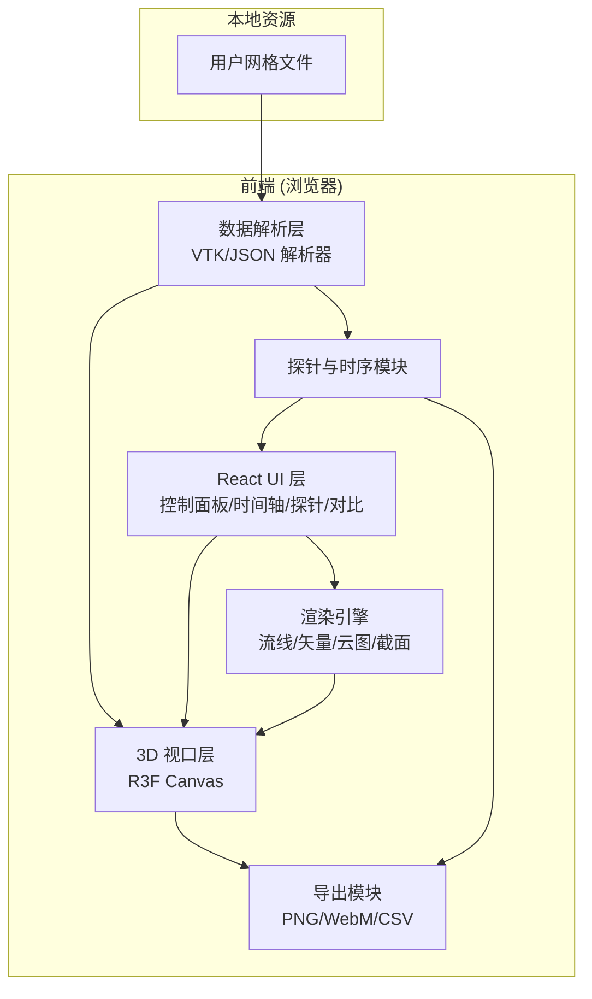
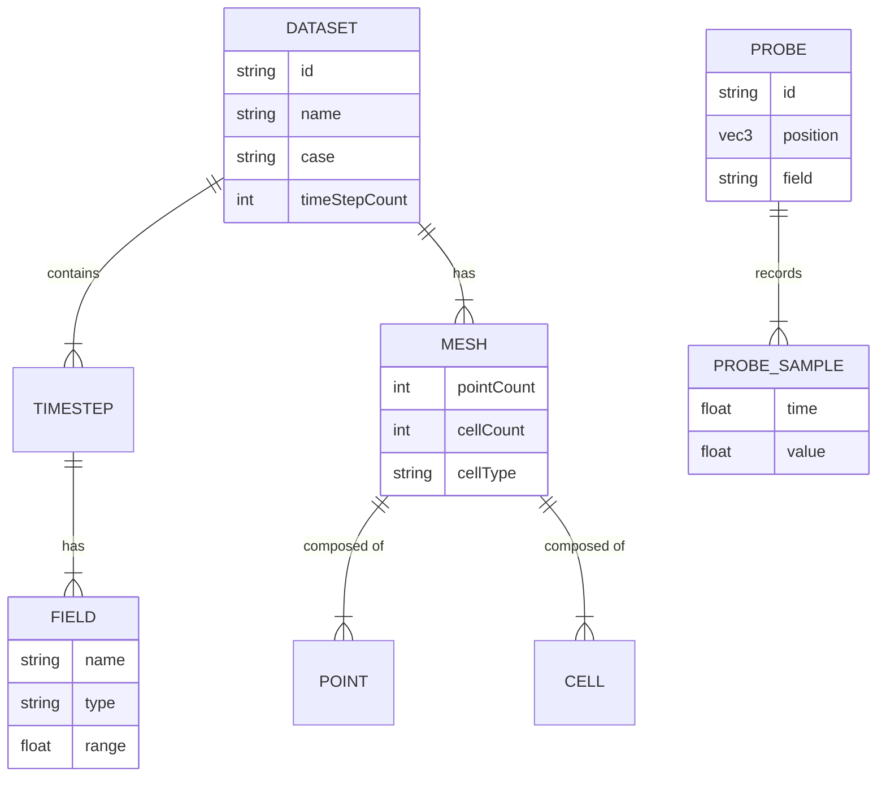

## 1. 架构设计



全栈纯前端架构，无后端服务；所有网格解析、渲染、探针采样、导出均在浏览器本地完成，保障数据安全与零部署成本。

## 2. 技术说明
- 前端：React@18 + TypeScript + tailwindcss@3 + vite
- 初始化工具：vite-init（`npm create vite@latest` React-TS 模板）
- 3D 渲染：three@0.160 + @react-three/fiber@8 + @react-three/drei@9 + @react-three/postprocessing@2
- 图表：recharts@2（探针时序曲线）
- 状态管理：zustand@4（轻量全局状态：当前文件、可视化模式、时间步、探针、对比工况）
- 数据解析：自研轻量 VTK Legacy（ASCII/二进制）解析器 + 自定义 JSON 格式
- 视频导出：MediaRecorder API（WebM） + Canvas `toBlob`（PNG）
- 后端：无
- 数据库：无（纯本地，使用内存 + IndexedDB 缓存最近文件可选）

## 3. 路由定义
| 路由 | 用途 |
|-------|---------|
| / | 工作台主视图（导入、渲染、截面、探针、时间步、导出） |
| /compare | 工况并排对比视图（多结果同步相机） |

## 4. 数据模型

### 4.1 核心数据模型定义



### 4.2 数据格式定义

**自定义 JSON 网格格式**（用于示例数据与轻量导入）：
```json
{
  "name": "cylinder_flow",
  "case": "Re=100",
  "mesh": {
    "points": [[x,y,z], ...],
    "cells": {"type": "tetra"|"hex"|"tri"|"quad", "indices": [[i0,i1,i2,...], ...]}
  },
  "fields": {
    "pressure": {"unit": "Pa", "components": 1, "timesteps": [[...], ...]},
    "velocity": {"unit": "m/s", "components": 3, "timesteps": [[[vx,vy,vz], ...], ...]}
  },
  "times": [0.0, 0.1, 0.2]
}
```

**VTK Legacy 格式**：支持 ASCII 与二进制 `STRUCTURED_POINTS` / `UNSTRUCTURED_GRID`，读取 `POINTS`、`CELLS`、`CELL_TYPES`、`POINT_DATA`（`SCALARS pressure`、`VECTORS velocity`）。

### 4.3 探针 CSV 导出格式
```csv
timestep,time,probe_id,x,y,z,pressure,velocity_x,velocity_y,velocity_z,magnitude
0,0.00,p1,1.2,0.5,0.0,101325.0,0.12,0.05,0.0,0.13
```

## 5. 渲染模块设计

| 模块 | 实现方式 |
|------|----------|
| 网格表面 | `BufferGeometry` + `MeshStandardMaterial`，按场值顶点着色 |
| 压力云图 | 顶点颜色映射 + 色带 LUT，可叠加等值线 |
| 速度矢量图 | `InstancedMesh` 箭头 Glyph，方向取速度向量，长度按幅值缩放 |
| 流线图 | RK2/RK4 积分生成流线 `LineSegments`，颜色按速度幅值，Bloom 增亮 |
| 等值面 | Marching Cubes（简化）按阈值提取 |
| 截面切割 | `Plane` + 自定义裁剪着色器，平面交线渲染截面数据 |
| 色带 | 预计算 jet/viridis/plasma/coolwarm LUT 纹理 |

## 6. 性能策略
- 大网格降采样显示阈值：单元 > 50万 启用简化模式
- 时间步数据按需解码，避免一次性驻留内存
- 流线积分使用 Web Worker 并行计算
- 视口空闲时降低采样率，交互时恢复全分辨率

## 7. 工况对比策略
- 同屏 2-3 个独立 R3F Canvas，共享相机参数（位置/目标同步）
- 差异高亮：对同名场做逐点差值，按差异幅度色带渲染
